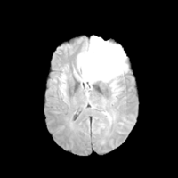
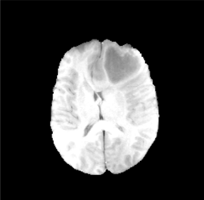
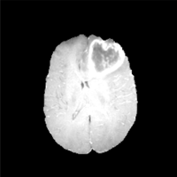
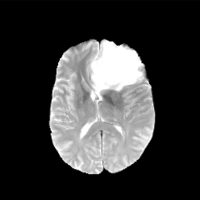
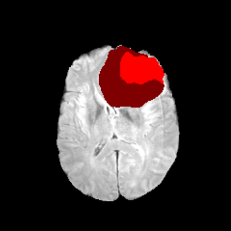
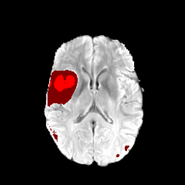
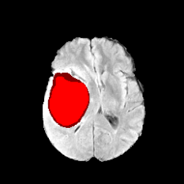
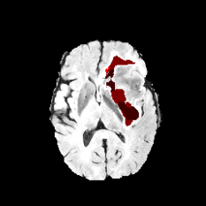
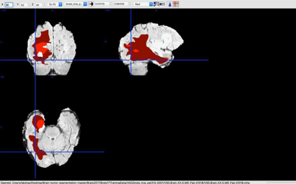

# Brain-Tumour-Segmentation

### Brief Introduction

The repository provides the code for Brain Tumer Segmentaion using fully convolutional U-Net. This examination, proposes a completely programmed strategy for brain tumor division, which is created based on U-Net profound convolutional systems. Our technique was assessed on Multimodal Brain Tumor Image Segmentation (BRATS 2015) datasets, containing 220 high-review brain tumor and 54-second rate of tumor cases. Cross approvals have demonstrated that our technique can get raising division effectively.

The implementation is based on keras and tested on Tensorflow backend.

### Dataset

The proposed method is trained and validated on the BRATS 2015 dataset. ], which consists of 54 low-grade and 220 high grade glioma patients volumes that are already made skull stripped and is registered by intra patient. No further preprocessing is done in it. In this dataset each patient has four MRI scan sequences that consists of namely FLAIR, T1c, T2 and T1. The dataset is already skull – strippedand registered into the T1c scan and is interposed into 1x1x1 mm3 with the sequence of 240x240x155. Few images of datset are :






You can request for dataset from [link](https://www.smir.ch/BraTS/Start2015),
P.S. don't ask me for the datset.

### Result
Here are some resulting images of sample taken as imput:







The final image obtained after completing the procedure:



### Requirements

To run the code, you first need to install the following prerequisites: 

* Python 3.5 or above
* numpy
* keras
* scipy
* SimpleITK

### How to run

1. Execute first `extract_patches.py` to prepare the training and validation datasets.
2. then `train.py` to train the model.
3. `predict.py` to make final predictions.

```
python extract_patches.py
python train.py
python predict.py
```

###

To get further information on this project please refer to [this paper](http://www.jmdet.com/wp-content/uploads/2019/02/4jmdet_12_2_4-2.pdf)
